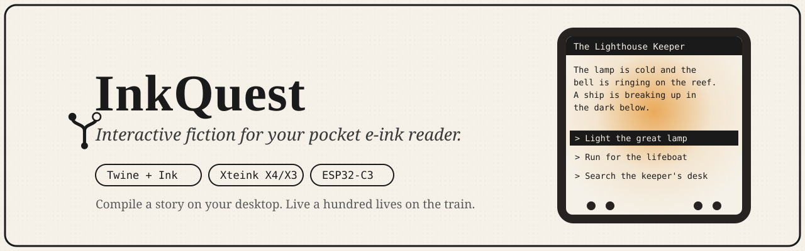
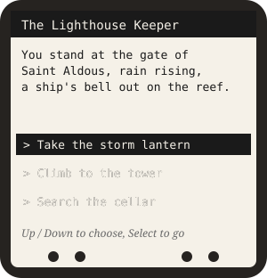
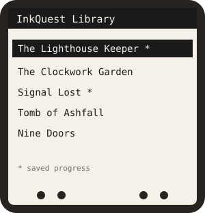
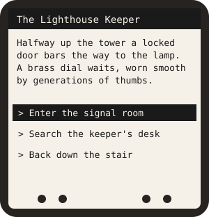
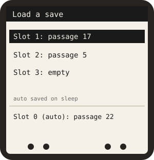

<!-- SEO: InkQuest is an open-source interactive fiction and choose-your-own-adventure (CYOA) runner for the Xteink X4/X3 e-ink e-reader (ESP32-C3). It plays branching Twine (Harlowe, SugarCube) and Ink (inklecate JSON) stories on device, with a Python compiler and validator, save slots, and autosave. Text adventure, gamebook, visual novel, interactive story engine for e-paper. Built with PlatformIO on the inkkit device HAL; works alongside CrossPoint Reader. -->

<p align="center">
  
</p>

<p align="center">
  <a href="https://github.com/mohitagw15856/InkQuest/actions/workflows/ci.yml"></a>
  
  
  
  
  
</p>

<p align="center">
  <b>Your e-reader is bored. Give it a quest.</b><br>
  InkQuest turns a Xteink pocket e-ink reader into a pocket gamebook: branching stories, real choices, multiple endings, and your progress saved to the SD card.
</p>

---

## What is InkQuest?

**InkQuest is an open-source interactive fiction (choose-your-own-adventure) runner for the Xteink X4/X3 e-ink reader.** You write a branching story in [Twine](https://twinery.org/) or [Ink](https://www.inklestudios.com/ink/), compile it on your computer into a tiny `.iqs` file, drop it on the SD card, and read it with the physical buttons. Variables, conditions, inventory flags and many endings all work, and the device remembers where you were.

It is a standalone firmware built on the [inkkit](https://github.com/mohitagw15856/inkkit) device layer, and it happily shares an SD card with the [CrossPoint Reader](https://github.com/crosspoint-reader/crosspoint-reader), so one device can hold your library and your adventures at once.

<p align="center">
  
</p>

## See it

<table>
  <tr>
    <td align="center"><br><sub><b>Library</b> with per-story progress</sub></td>
    <td align="center"><br><sub><b>Reading</b> with button-picked choices</sub></td>
    <td align="center"><br><sub><b>Save slots</b> plus autosave on sleep</sub></td>
  </tr>
</table>

<sub>The previews above are rendered mockups of the real on-device layout (monochrome e-ink, a 5x7 bitmap font, an inverted title bar and selection). Drop your own device photographs in <code>docs/images/</code> once you have flashed it.</sub>

## Why you might like it

- 📖 **Real interactive fiction, not a toy.** Numeric and boolean variables, inventory flags, conditional choices and conditional text, and as many endings as you like.
- ✍️ **Write in tools you already know.** Compile [Twine](https://twinery.org/) (Harlowe or SugarCube) and [Ink](https://www.inklestudios.com/ink/) stories, with clear errors that name the passage and the unsupported feature instead of failing silently.
- 💾 **Never lose your place.** Multiple save slots per story on the SD card, plus an autosave whenever the device goes to sleep.
- 🪶 **Tiny and frugal.** The engine streams one passage at a time from the card and never loads the whole story into the ESP32-C3's small RAM.
- 🔍 **Catches broken stories before the device does.** `inkquest validate` finds dead ends and unreachable passages for you.
- 🧩 **Plays well with others.** A standalone app on the inkkit HAL that sits beside CrossPoint on the same card.
- 🧪 **Actually tested.** A Python test suite, host C++ tests, a cross-language format check, and a full firmware build all run in CI.

## How it works

```
   Your desktop                              Your Xteink reader
 ┌──────────────┐   inkquest compile   ┌───────────────────────────┐
 │ Twine / Ink  │ ───────────────────► │  /inkquest/stories/*.iqs  │
 │   story      │      .iqs file       │                           │
 └──────────────┘                      │   StoryEngine streams one │
        │                              │   passage at a time, you  │
        │  inkquest validate           │   choose with the buttons │
        ▼                              │   and it saves to the SD  │
  dead ends? unreachable?              └───────────────────────────┘
```

Heavy work (parsing, laying out the graph, compiling expressions to bytecode) happens once on your computer. The device just reads a compact, seekable binary. See [ARCHITECTURE.md](ARCHITECTURE.md) for the full design and the standalone-versus-fork decision.

## Quick start

### 1. Author and compile a story

```sh
cd companion
python3 -m inkquest validate ../stories/the-lighthouse-keeper/the-lighthouse-keeper.twee
python3 -m inkquest compile  ../stories/the-lighthouse-keeper/the-lighthouse-keeper.twee \
    -o ../stories/the-lighthouse-keeper/the-lighthouse-keeper.iqs
```

For an Ink story, compile it with inklecate first, then feed the JSON:

```sh
inklecate -j -o story.json story.ink
python3 -m inkquest compile story.json --from ink -o story.iqs
```

### 2. Flash the firmware (PlatformIO)

```sh
pio run -e xteink_x4 -t upload   # build and flash over USB (or -e xteink_x3)
pio device monitor               # serial monitor at 115200
```

The device build gets its complete device layer (the `Hal*` HAL and the vendored SDK hardware libraries) from [inkkit](https://github.com/mohitagw15856/inkkit), pinned in `platformio.ini`; the `xteink_x4` and `xteink_x3` environments build identical firmware with runtime device detection. See [platformio.ini](platformio.ini) and [docs/HARDWARE_TESTING.md](docs/HARDWARE_TESTING.md).

### 3. Put stories on the SD card

```
/inkquest/stories/the-lighthouse-keeper.iqs
/inkquest/stories/the-lighthouse-keeper.bmp   (optional cover)
```

Power on, pick a story, and go.

## The bundled demo

**The Lighthouse Keeper's Lantern** is an original, public-domain-setting story of about 30 passages with several endings. You are the new keeper of a lonely island lighthouse on a storm night, with a ship in distress on the reef. It uses variables, conditional choices and conditional text, and its Twine source and compiled `.iqs` both live in [`stories/the-lighthouse-keeper/`](stories/the-lighthouse-keeper/).

## Frequently asked questions

### What file formats can InkQuest read?
Compiled `.iqs` files on device. On the desktop, the companion compiles **Twine** (Twee 3 notation or published HTML, in the Harlowe or SugarCube dialects) and **Ink** (inklecate JSON) into `.iqs`. The exact supported subset is in [docs/FORMAT.md](docs/FORMAT.md).

### Which device does it run on?
The Xteink X4 and X3 pocket e-readers, which use an ESP32-C3 with a 4.2 inch e-ink display, SD card, and physical buttons. It is built with PlatformIO on the inkkit device HAL.

### Do I need CrossPoint Reader to use InkQuest?
No. InkQuest is its own standalone firmware. It only borrows CrossPoint's SD card convention so a single card can carry both CrossPoint books and InkQuest stories. It was designed and tested against CrossPoint v1.5.0 as a reference.

### Does it support variables, conditions and multiple endings?
Yes. Integer and boolean variables, inventory flags, conditional choices, conditional text, and any number of endings. Expressions are compiled to a small stack bytecode that the device evaluates without using the heap.

### Does it save my progress?
Yes. There are multiple manual save slots per story on the SD card, plus an automatic save whenever the reader goes to sleep, so you can put it down mid-adventure.

### How is it so small on an ESP32-C3?
The story is pre-processed on your computer into a seekable binary with a passage offset table. On device, only that table and the variable state stay in RAM; passages are streamed one at a time from the SD card. See [ARCHITECTURE.md](ARCHITECTURE.md).

### Is it free and open source?
Yes, under the MIT licence, the same as inkkit and CrossPoint.

## What is InkQuest, in one line?

> A pocket gamebook engine for e-ink: write branching Twine or Ink stories, compile them to a tiny format, and play them with real choices and saved progress on a Xteink X4/X3.

## Repository layout

```
src/core/        portable story engine, saves, word wrap, BMP decoder (host tested)
src/device/      on-device UI, rendering, storage, input (built on inkkit)
src/main.cpp     Arduino setup/loop shell
companion/       Python CLI: Twine / Ink -> .iqs, and validation, with pytest
stories/         the bundled demo story (Twine source and compiled .iqs)
test/host/       host unit tests for the core (plain g++)
test/device/     device compile check against stub HAL headers
docs/            format spec, hardware testing checklist, inkkit gaps, images
scripts/         the font generator
```

## Building and testing

No hardware is needed to run the tests.

```sh
cd companion && python3 -m pytest        # companion (Python)
INKKIT=/path/to/inkkit ./test/host/run.sh            # portable core (host C++)
INKKIT=/path/to/inkkit ./test/device/compile_check.sh # device layer compile check
```

CI runs the companion tests, the host C++ tests, the device compile check, and a full PlatformIO firmware build on every push and pull request.

## Documentation

- [ARCHITECTURE.md](ARCHITECTURE.md) : design, and the standalone-versus-fork decision.
- [docs/FORMAT.md](docs/FORMAT.md) : the `.iqs` and save byte formats, the bytecode, and the supported Twine and Ink subsets.
- [docs/HARDWARE_TESTING.md](docs/HARDWARE_TESTING.md) : the on-device checklist.
- [docs/INKKIT_GAPS.md](docs/INKKIT_GAPS.md) : what inkkit does not yet provide.
- [CONTRIBUTING.md](CONTRIBUTING.md) : how to contribute.

## Related projects

- [inkkit](https://github.com/mohitagw15856/inkkit) : the shared device HAL InkQuest is built on.
- [CrossPoint Reader](https://github.com/crosspoint-reader/crosspoint-reader) : the community e-book firmware InkQuest sits beside.
- [Twine](https://twinery.org/) and [Ink](https://www.inklestudios.com/ink/) : the interactive fiction tools you author with.

## Licence

MIT. See [LICENSE](LICENSE). Compatible with inkkit (MIT) and CrossPoint (MIT).

<p align="center"><sub>Made for people who read on the bus and would rather be the hero.</sub></p>
